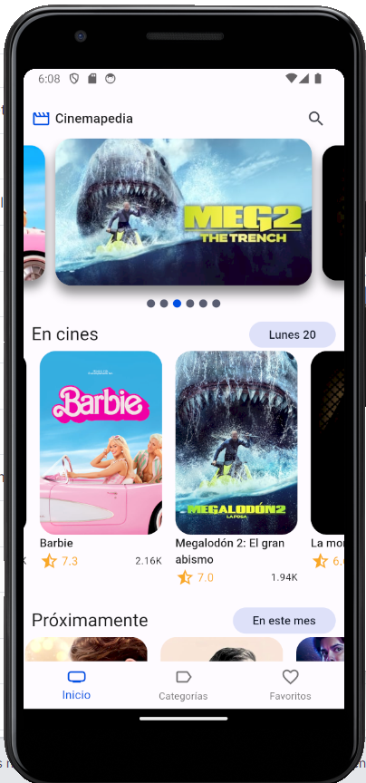
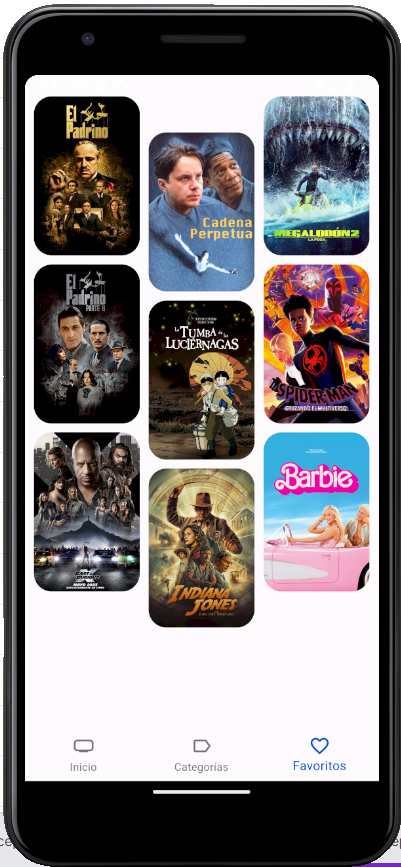

# Cinemapedia 


Cinemapedia es un proyecto de app realizado con la tecnología de Flutter para la visualización de películas online.

La finalidad de este proyecto es además de mostrar la funcionalidad de la app, poner en valor la seguridad en la app al haberla desarrollado con los principios de **Arquitectura limpia**.

## Arquitectura limpia 🔎

Este proyecto ha sido desarrollado asegurando unos cimientos primarios en la implementación. La idea es desarrollar la app con la finalidad de que sea mas fácil realizar futuras implementaciones de una forma mas fácil a la hora de realizar cambios de APIs y de gestionar areas de cliente, pensando ya a nivel de entidades que queremos mantener si fuéramos una empresa, los cuales sería  mas difícil implementar si no siguiéramos este orden de desarrollo en la app.

### Estructura de arquitectura limpia:


Resumidamente, tenemos tres capas de implementación. En la capa de **Dominio**, creamos nuestros cimientos en base a los requisitos que tienen que cumplir los datos que vamos a utilizar. En **Infraestructura** manejamos la manera en la que queremos trabajar con esos datos y en **Presentación** es donde se realiza toda la lógica sustancial para mostrar los resultados en la app .

## Diseño 🎥






## Funcionalidad 🔩


## Instrucciones para ejecución 📋

1. Copiar el .env.template y renombrarlo a .env
2. Cambiar las variables de entorno (The MovieDB)
3. Cambios en la entidad, hay que ejecutar el comando
```
flutter pub run build_runner build
```